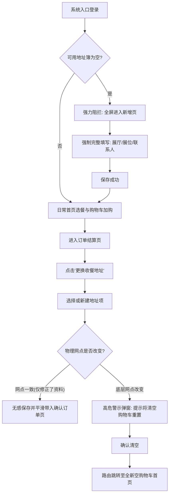

# 收餐地址技术规格说明 (Address Spec)

> **版本信息**
> - **版本号**: v1.0
> - **状态**: 定稿
> - **最后更新**: 2026-02-26
> - **变更摘要**: 基于 PRD 与设计规范，初始化收餐地址页 9 大模块技术规格说明，涵盖级联逻辑、极严搜索、发票联动及切址拦截。

> **页面ID**：`guangjiaohui_address`  
> **路由层级**：H5 首屏拦截 / 正常收银台进入  
> **模块**：用户地址与履约防错前台

---

## I. 业务背景与用例模型 (Business Context)

广交会展馆（单体巨大、内部禁车）的苛刻履约条件下，不能采取 C 端普通的“骑手按地图定位找用户”模式，必须转为 **大仓干线集散 + 馆内步兵盲投** 接力体系。

这就要求**订单上的物理地址坐标必须无隐患的绝对精准**。在前端实现上：
1. 首屏强制拦截所有“没有地址/地址不全”的用户，未建白名单前禁止进入餐厅。
2. 为外地参展商做认知降维，只选“大展厅”，例如“8.0展厅”。
3. 在最终履约分单时，系统拿到的必须是高度准确的物理节点 (如 `8.0-1`)，从而实现前台傻瓜式防错与后台高精度调度的完美结合。

---

## II. 核心数据模型 (Data Model)

收餐地址表单由以下核心字段构成。在表单提交和更新时，前台显示数据与后台派送数据解耦：

| 字段名称 | 英文键名 | 数据类型 | 必填 | 校验约束 / 枚举 | 业务用途 |
| :--- | :--- | :--- | :--- | :--- | :--- |
| **主展馆区** | `areaName` | String | 是 | A区/B区/C区/D区 | 地图顶层划分区 |
| **楼栋层** | `floorCode` | String | 是 | 1F/LF/M1等 | 直接透底不翻译，用于大仓物流 |
| **展厅ID** | `hallId` | String | 是 | `hall_8_0` 等 | 前置锁定用户所在的宏观建筑 |
| **展厅全名** | `hallName` | String | 是 | 例: `8.0展厅` | 前端级联展示 |
| **终端展位号** | `boothCode` | String | 是 | 必须在展厅字典中通过搜索落点 | 展示与末端步兵按图标寻找(二级终点) |
| **真实网点ID** | `deliverPointId` | String | **是** | `8.0-1` 等 | **隐式后台传参，供干线骑手导航(一级导航)** |
| **联系人姓名** | `contactName` | String | 是 | 长度大于1 | 步兵外呼验证 |
| **手机号** | `userPhone` | String | 是 | 11位数字，前端只能展示SSO带入值 | 鉴权与触达唯一标示 |

**发票联动强约束组** (Invoice Optional Fields):
> 抬头、税号、邮箱为强联动关系，若选填则必须满足组合完整性。
- `invoiceTitle` (抬头)
- `taxNo` (税号)
- `invoiceEmail` (邮箱) 

---

## III. 状态机与业务逻辑 (State Machine & Rules)

为了彻底杜绝广交会恶劣派送环境下的超长距离空跑和错投，地址相关的状态流转引入了**极端强干预**策略，涵盖以下四大子场景：

### 3.1 首次进入与 SSO 强拦截
- **逻辑基座**：收餐地址是履约的第一信条，未填地址者不具备浏览系统菜单的资格。
- **触发条件**：用户通过 SSO 静默登录进入 H5 环境。
- **动作执行**：系统前置检查本地/云端可用地址簿。若地址数量为 `0`，执行强阻断，全屏接管或自动路由至**新增收餐地址页**。
- **退出条件**：不提供退场路由、不提供“稍后再说”选项，**除非完成完整合法保存，否则绝对禁止浏览商品列表或进入点餐流程**。

### 3.2 订单确认页“换址回切”的防灾逻辑
- **业务痛点**：用户在 A 馆看了一圈商品加入购物车，临门一脚跑到 B 馆，如果不提示清空而让他直接在 B 馆签收，将造成无解的数十公里跨馆“飞去来器单”。
- **分支 1（不同网点的实质变更）**：如果用户从订单结算页跳转回地址簿，在编辑或新增后，改变了**原本的底层物理网点（deliverPointId 发生变化，如从 A 区变成 B 区）**，当他选定该新地址并试图返回时，必须全屏弹窗警告：
  > _“您变更了收餐展厅，受现场物理交付限制，当前购物车内的餐品将被清空，需要重新选餐，是否确认？”_
  - 点击确认：清空旧购物车 -> 拿着新网点回到点单首页重新开局。
  - 点击取消：保留旧购物车 -> 地址切回回退前状态。
- **分支 2（同网点的资料修正）**：如果用户只是改了“发票抬头”或者“联系人电话”，而 `deliverPointId` 未变。不阻断，平滑返回订单结算页，购物车继承。

### 3.3 地址库容量防爆
- 用户最多同时保有 **3 个** 有效地址。
- 当已通过合法判定拥有三个地址后，UI 层面的“新增地址”按钮强制呈 `Disabled` 置灰禁用态，同时必须配文告知：“最多可创建 3 个收餐地址”。

### 3.4 图解核心链路 (核心框架)

---

## IV. 展位联想全屏模块逻辑 (Booth Search Policy)

表单中“展位”并非传统 `Input`，而是一个触发态“伪装表单项”。
1. **触发前**：若展厅未选中，禁止点击。
2. **展开全屏后**：高占比弹出，激活系统软键盘模糊搜索当前展厅的 `boothDictionary` 集合集。
3. **极严回填**：未命中时展示「未匹配到标准展位及安抚提示」，且 **无强行暴力人工通道绕过选项**，绝对规避雪崩级客诉。

---

## V. 发票前台开具防错 (Invoice Validation)

针对 B端采购高频诉求，前置拦截“残缺票据信息”，杜绝运营返工：
- 前端定义 `strictInvoiceValidator`：如果 `InvoiceTitle, TaxNo, InvoiceEmail` 发生了 `ANY` 的真值触发，则立刻判断 `ALL` 是否为真；如果存在空洞，则阻断提交并抛出 “如需开票，请完整填写抬头、税号及邮箱”。
- 发票记录是 **附着于单个收餐地址** 上的（非全局唯一）。

---

## VI. B端系统契约要求 (System Integration Contract)

1. **接口1: 区域聚合级联树 `GET /api/v1/zones/tree`**
   - 包含 Area -> Floor -> Hall。如文档所载，后端在下发 `8.0展厅` 这一层级时，必须将物理切分的 `8.0-1`、`8.0-2` 进行前端无差异合并消重。

2. **接口2: 指定展厅详细展位字典 `GET /api/v1/zones/{hallId}/booths`**
   - 下发结构不仅含前端呈现值 `boothCode` (如D24)，必须挂载隐含关键物理坐标 `deliverPointId`。

3. **接口3: 新增/更新用户地址记录 (同前端持久化 Schema)**
   - 表单对象除基础信息外，需带有 SSO 授信后的隐藏脱敏 Token 参数及上文述及的所有必要强校验字段。

---

## VII. 验收测试核心关注点 (E2E Test Checklists)

1. [x] **纯净开局测**：清理 LocalStorage，刷新立刻进入新增态。
2. [x] **残缺发票防错**：填入有效地址、展位、姓名后，仅输入“公司抬头”，点击提交 -> 【必须报红拦截】。
3. [x] **极严选址测**：先选8.0，然后进入展位选择器 -> 输入 `XXXXXXXXXXX` -> 无搜索结果 -> 【确认无绕过保存后门】。
4. [x] **地址封顶测**：录入满 3 条合法地址，回到列表 -> 【确认新增按钮灰显拦截】。
5. [x] **同馆切域测**：在包含跨展馆状态下（场景模拟：`?from=order&hall=A`）切为 `B` 展馆地址 -> 【必须引出换馆阻断二次弹窗】。
